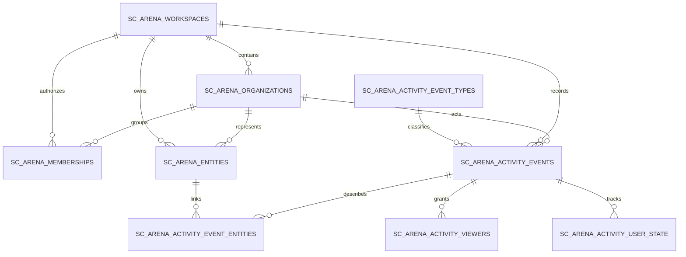

# SparkClaw AI Arena data model

## Naming and ownership

- Every new AI Arena table uses the `public.sc_arena_` prefix.
- Private RLS helper functions live in the `sc_arena_private` schema.
- Arena Auth and account-linked activity belong in the Supabase project configured by `SUPABASE_URL`.
- The separate SparkClaw Program DB remains the source for cohort/program records. It is not the target of this migration.

Before applying a migration, verify that the selected dashboard project ref exactly matches the intended Arena Auth project. Never infer a project from the dashboard account email or display name.

## Relationship model

## Why the ledger is separate from current state

The operational stores remain authoritative for the latest connection, Community, and Bounty state. `sc_arena_activity_events` is an append-only, presentation-safe history for My Log. This avoids losing earlier status changes when a current record is updated and allows one reverse-chronological query across all three domains. Only actions created inside SparkClaw AI Arena are eligible; Program DB events, perks, weekly reports, and activity from other platforms are explicitly out of scope.

Each event has:

- a stable source idempotency key: `(workspace_id, source_system, source_event_id)`;
- an actor and optional actor organization;
- one primary entity plus optional related entities;
- an audience scope and optional explicit viewers;
- a short, safe title/summary and route target;
- an occurrence timestamp distinct from the database write timestamp.

Raw post bodies, internal review notes, emails, phone numbers, credentials, and other private payloads must not be copied into the ledger metadata.

## Access model

- The browser never writes activity rows directly.
- Server functions append events with the service credential only after an authoritative domain write succeeds.
- A signed-in user reads through `sc_arena_my_log`, which runs with the caller's RLS context.
- RLS grants an event to its actor, explicit viewers, the related organization, or SparkLabs staff/admin as appropriate.
- User-controlled auth metadata is not used directly inside RLS policies. The server synchronizes a normalized membership before reading.

## Query and scale model

- My Log uses keyset pagination on `(occurred_at desc, id desc)` rather than offset pagination.
- Composite indexes cover workspace/domain/actor timeline reads and RLS membership/viewer lookups.
- At the current cohort size, a single indexed activity table is simpler and faster to operate than partitions. Add monthly or quarterly range partitions only after measured growth justifies them.
- Realtime may later be used as an invalidation signal, but the authenticated My Log query remains the source of truth.

## Rollout

1. Confirm the exact Supabase project ref in the dashboard.
2. Review and apply `supabase/migrations/20260812090000_sc_arena_activity_ledger.sql` in one transaction.
3. Verify all nine tables, RLS policies, functions, grants, and indexes.
4. Deploy server dual writes and the `/api/my-log` read path.
5. Backfill only Arena-owned Discover, Community, and Bounty Blob events in timestamp order with stable source ids and `on conflict do nothing` semantics. Never backfill Program DB event registrations, perks, weekly reports, or other-platform activity.
6. Reconcile counts per source and date before treating the ledger as complete history.
7. Keep legacy reads as a temporary fallback until backfill and dual-write reconciliation pass.
